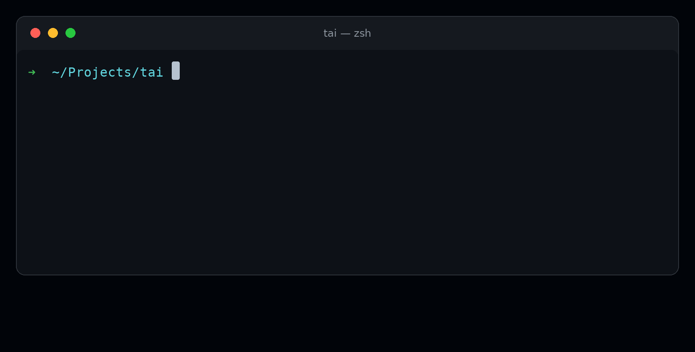

<div class="demo">
  
</div>

<div class="install-quick">

```sh
curl -fsSL https://raw.githubusercontent.com/mlibre/Terminal-AI-Helper/main/install.sh | bash
```

</div>

Start with [the keys](/usage), or read [how it is built](/architecture). Your
history never leaves the machine — secrets and stray keys are filtered out
before anything is stored — and uninstall is one command that removes
everything.

<style>
.demo { margin: 2.5rem 0 1rem; }
.demo img { width: 100%; border-radius: 12px; border: 1px solid var(--vp-c-divider); }
.install-quick { margin: 1rem 0 2rem; }
</style>
