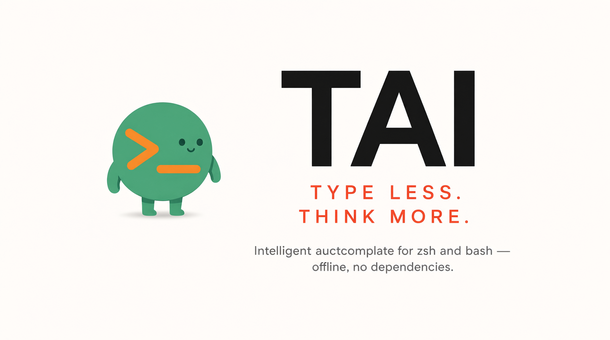

# TAI >_ دستیار هوش مصنوعی ترمینال 💻



`tai` فرمان‌هایی را که واقعاً اجرا می‌کنید یاد می‌گیرد و هنگام تایپ پیشنهاد
می‌دهد. zsh و bash پیشنهاد را بومی و در پروسه‌ی خودشان انجام می‌دهند — بدون
پایتون، سوکت یا سرویس پس‌زمینه در مسیر کلیدها. آفلاین، فقط کتابخانه‌ی
استاندارد.

`systemctl` را تایپ کنید ← راهنمای خاکستری `restart nginx`؛ `→` یا `Ctrl-F`
آن را می‌گیرد، `Alt-F` یک کلمه را. خط خالی، فرمان بعدیِ فرمان قبلی‌تان را
پیش‌بینی می‌کند. `Tab` فایل‌ها، پوشه‌ها و گزینه‌ها را می‌چرخاند؛ `Ctrl-Space`
فهرستی را باز می‌کند که پیش‌تر ببینیدش:

```text
systemctl <→>      systemctl restart nginx  ← راهنما، گرفته شد
git <Tab>          pull      status          ← فهرست، زیر خط
cd D<Tab>          Desktop/  Documents/  Downloads/
```


[معماری](docs/architecture.md) · [توسعه](docs/development.md) · [سایت مستندات](https://mlibre.github.io/Terminal-AI-Helper/) · [English](readme.md)

## نصب

```sh
curl -fsSL https://raw.githubusercontent.com/mlibre/Terminal-AI-Helper/main/install.sh | bash
```

این فرمان TAI را در `~/.tai` دانلود می‌کند و نصب‌کننده را از همان‌جا اجرا
می‌کند؛ اجرای دوباره‌اش بعداً TAI را در‌جا به‌روز می‌کند. نصب‌کننده برای هر دو
پوسته افزونه را فعال، تاریخچه‌ی موجودتان را وارد و نمایه را می‌سازد —
پیشرفت، یک خوش‌آمد کوتاه، و یک فرمان برای کپی:

```text
→ cloning tai to /home/you/.tai…
→ learning from your history, building the index…
✓ zsh installed
✓ bash installed
   _
  | |_  __ _ ___     the terminal that knows your next command
  | ' \/ _` (_-<
  |_||_\__,_/__/

  1. Type a few letters — tai finishes the command in grey. → takes it.
  2. Tab opens a menu of what fits. Enter picks; a second Enter runs.
  3. It learns from your history — offline, private, no account.

  More keys: Ctrl-F takes the whole hint · Ctrl-Space opens the list
             Down peeks at what usually follows

  Try it now: type "cd " and watch the grey.
→ exec zsh
```

آخرین خط اختیاری نیست: ترمینالی که از قبل باز است تا باز کردن ترمینال تازه،
هم پس از نصب و هم پس از `tai update`، نسخه‌ی قدیمی را نگه می‌دارد.

## کلیدها

| کلید                    | چه می‌کند                                                                                     |
| ----------------------- | -------------------------------------------------------------------------------------------- |
| `Tab`                   | فایل‌ها، پوشه‌ها، گزینه‌ها را می‌چرخاند؛ روی خطِ تک‌واژه، خط‌های آموخته‌شده اول می‌آیند، به ترتیبِ پنل |
| `Ctrl-Space` / `Ctrl-T` | فهرست را باز می‌کند، چه راهنما باشد چه نباشد؛ دوباره فشار برای جابه‌جایی انتخاب                |
| `Enter`                 | مورد انتخاب‌شده را می‌گیرد و متوقف می‌شود؛ `Enter` دوم خط را اجرا می‌کند                         |
| `→`                     | راهنمای انتهای خط را می‌گیرد، وگرنه مکان‌نما را یکی به راست می‌برد                              |
| `Ctrl-F`                | راهنما را می‌گیرد                                                                             |
| `Alt-F` / `Ctrl-Right`  | **یک کلمه** از راهنما را می‌گیرد و باقی را برای تایپ جا می‌گذارد (bash: «Ctrl-Right»)          |
| `Alt-G`                 | فرمانی که پس از آخرین فرمان آمده بود (bash)                                                  |

هر کلید یک پرسش. `Ctrl-Space` فهرست را وقتی باز می‌کند که بخواهید نگاه کنید
نه نهایی؛ روی `Ctrl-T` هم هست؛ راهنما مالِ `→` است، نه `Tab` — اما روی خطی
که هنوز یک واژه است، `Tab` با خودِ خط‌های آموخته‌شده باز می‌شود، کامل و به
ترتیبی که داشبورد مرتب می‌کند، و نام‌های نصب‌شده زیرشان. متن چسبانده‌شده
(Paste) فهرست را خودبه‌خود باز
نمی‌کند — یک پرسش نیست — و با تایپ یا حذف یک حرف، فهرست دوباره برمی‌گردد.
برداشتن پوشه از فهرست درخواست رفتن به آن نیست، پس `Enter` می‌گیرد و متوقف
می‌شود؛ دومی اجراش می‌کند. مورد انتخاب‌شده برجسته است، نام پوشه رنگ پوشه‌ی
ترمینال شما را دارد، و بخش مشترک موردها یک بار، بالای آن‌ها، کشیده می‌شود:

```text
cd media/mlibre/B/<Tab>          Clip/   Movies/   Projects/   Teb/
```

هر مورد فقط آنچه را **می‌افزاید** نشان می‌دهد؛ `Enter` کل مسیر را می‌نویسد.
در **bash** رتبه‌بندی یکسان است و همان کلیدها کار می‌کنند، اما readline نه
فهرستی زیر خط می‌کشد و نه متن راهنما — «→» و «Ctrl-F» راهنما را می‌گیرند،
«Ctrl-Right» یک کلمه‌اش را، و «Tab» مستقیم تکمیل می‌کند؛ پیش‌فرض فقط پس از
`tai` است، یا برای هر فرمان با `TAI_COMPLETE_ALL=1`.

## چه چیزی پیشنهاد می‌دهد، و چه چیزی را نه

### باید خط شما را کامل کند

`ls -l` مقدار `ls -la` را پیشنهاد می‌دهد، نه خودش را؛ فرمانی کامل چیزی
پیشنهاد نمی‌دهد. نام یادگرفته‌شده و مسیر هم‌نام در پوشه‌ی جاری یک تکمیل‌اند.
نامی روی `PATH` که قابل اجرا نیست — بدون بیت اجرا یا یک پوشه — هرگز پیشنهاد
نمی‌شود.

### پوشش‌دهنده یک دیوار نیست

`sudo`، `doas`، `nohup`، `time`، `nice`، `ionice`، `stdbuf` و `command` فرمانِ
بعد از خود را اجرا می‌کنند، پس خطِ پشت آن‌ها گویی آن پوشش‌دهنده نبوده تکمیل
می‌شود — `sudo git` مقدار `sudo git pull --rebase` را پیشنهاد می‌دهد. `env` و
`xargs` کنار گذاشته شده‌اند: آنچه بعد می‌آید را چنان تغییر می‌دهند که
برگرداندن پوشش‌دهنده دروغ می‌شد.

### باید وجود داشته باشد

فرمانی که مسیرش رفته پیشنهاد نمی‌شود، هر چقدر هم که تایپش کرده باشید —
`cd ~/projects/myapp` به‌محض نبودن آن پوشه دیگر بالاترین پیشنهاد برای `cd`
نیست. توکن‌های ناخوانده *نامعلوم*اند و نامعلوم چیزی حذف نمی‌کند: `~main`
حداقل به اندازه‌ی یک پوشه‌ی خانگی، «کامیت قبلی روی `main`» در git است.

```sh
tai doctor        # گزارش می‌دهد: «stale paths: N از M فرمان پیشنهاد نمی‌شوند»
tai purge --stale # آن ردیف‌ها را حذف و سپس نمایه را بازمی‌سازد
```

### یک قرارداد، شاهد نیست

tai یک پیکره‌ی کوچک همراه دارد تا پوسته‌ی تازه هم به `ls -` پاسخ `ls -la`
بدهد — همه حدس‌اند و پایین‌تر از هر چه تاریخچه‌تان دیده. `..`، `.` و `-`
مقصد نیستند — در همه‌جا درست‌اند، پس تعداد تایپشان می‌گوید چند بار عقب
رفته‌اید، نه کجا می‌خواستید. برای `cd .` هنوز پیشنهاد می‌شوند؛ فقط رتبه‌ای را
که با شاهد نمی‌توانند ببرند از دست می‌دهند.

### یک مسیر را فایل‌سیستم پاسخ می‌دهد

تاریخچه آخرین فایل را می‌گوید — هرگز فاییلی که یک دقیقه پیش دانلود شده. پس
برای خطی که به فایل ختم می‌شود، فایل‌های واقعاً موجود کاندیدا هستند،
تازه‌ترین‌ها اول، و آموخته‌شده فقط تا وقتی جاست که هنوز *فایلی* باشد:

```text
# تاریخچه: فقط `chmod +x script`
chmod +x        راهنما: ~/Downloads/Freebuff-0.0.154-linux-x86_64.AppImage
```

ریشه‌ها پوشه‌ی جاری و پوشه‌های دانلودند — `$XDG_DOWNLOAD_DIR`، `~/Downloads`،
`~/Download`، `~/Desktop` — و نه زیرپوشه‌ها: نزول باعث شد `chmod +x` پاسخ یک
`.pyc` بدهد. بیشتر با `TAI_FILE_ROOTS=~/tmp:~/scratch`. و واژی که خودِ پوشه
را نام ببرد با درونِ آن کامل می‌شود — `cat ~/tmp` پاسخش `~/tmp/x` است، نه
`~tmpx`.

### cd با پوشه‌هایی که همین‌جا هستند پاسخ می‌گیرد

`cd` مقصدها را فهرست می‌کند — پوشه‌های پوشه‌ی جاری و آن‌ها که تاریخچه دارد —
و هیچ‌گاه فایل نه. مقصدی که جای دیگری یاد گرفته شده از همین‌جا داوری می‌شود:
`vllm` برهنه که در پوشه‌ای دیگر ثبت شده، دو پوشه دورتر از vllm پیشنهاد
نمی‌شود — همان فرقِ میان یادگاری و پیام خطا.

### پیمایش تاریخچه، تاریخچه است؛ systemctl واحدهایش را کامل می‌کند

بالا-پایین در تاریخچه در تاریخچه می‌گردد — فهرست آزاد برای خطی است که شما
*تایپش می‌کنید*، و خطی که از تاریخچه آمده با فهرستی از خودش پاسخ نمی‌گیرد.
`sudo systemctl restart her<Tab>` میان فایل‌های واحد واقعی می‌چرخد — از
فهرستی که روزی یک‌بار خوانده و بعد در خود پوسته نگه داشته می‌شود: هیچ
پروسه‌ای سر راه کلیدها نیست. `--user` واحدهای کاربر را کامل می‌کند؛ فعلِ
نیمه‌تایپ‌شده (`resta`) هیچ‌چیز نمی‌گیرد، چون واحد بعدش حدس است.

### غلط تایپ با چیزی که غلطِ آن است پاسخ می‌گیرد

وقتی هیچ‌چیز خط را ادامه نمی‌دهد، نما (glimpse) خط‌های آموخته‌شده‌ای را نشان
می‌دهد که هر واژ تایپ‌شده را دارند. واژی که یک حرف با واژی در تاریخچه فاصله
دارد (`forestt` → خط‌های `beauty-forest`) *به‌جای همان واژ* پاسخ می‌گیرد، و
یک‌باره‌ای که سایه‌ی یک عادت است — `tai sintall` در برابر `tai install` —
خودِ ایندکس زیر عادتش رتبه می‌شود. حتی وقتی شواهد کاملاً مساوی است —
`tai un` در برابر `tai unsintall` و `tai unisntall` کنارِ `tai uninstall`،
هرکدام یک بار — املای قوی‌تر می‌ایستد و غلط‌ها زیرش رتبه می‌شوند؛ هم در
پرامپت و هم در `tai suggest`.

### ابزاری که هرگز اجرا نکرده‌اید هم پاسخ می‌گیرد

فرمانی روی `PATH` تایپ کنید و tai `tool --help` را پیشنهاد می‌دهد — تنها
چیز صادقانه‌ای که درباره‌ی فرمانی می‌توان گفت که تاریخچه‌تان هرگز ندیده
است. یک بار اجراش کنید و tai راهنمای واقعی `--help` را در پس‌زمینه می‌خواند،
پس `tool <Tab>` زیرفرمان‌ها و گزینه‌هایش را می‌داند:

```text
9router --p   →  9router --port          (راهنما: ort)
9router --n   →  9router --no-browser
```

فرمان‌های خودتان همیشه بالاتر از خوانده‌شده از `--help` رتبه می‌گیرند، و پاسخ
یک فهرست کوتاه است: ۳۲ نامزد برای هر پیشوند، ۶۴ فعل و ۹۶ گزینه برای هر ابزار.

### اگر افزونه‌ی دیگری هم راهنما می‌کشد

`POSTDISPLAY` یک جایگاه است، مشترک با افزونه‌هایی مثل
[zsh-autosuggestions](https://github.com/zsh-users/zsh-autosuggestions). **هر
دو راهنما کار می‌کنند** — `→`، `Ctrl-F` و `Alt-F` هر چه روی صفحه است می‌گیرند،
و tai هرگز راهنمایی را که نکشیده پاک نمی‌کند. در هر لحظه فقط یک راهنما دیده
می‌شود؛ نصب‌کننده وقتی autosuggestions را پیدا کند متوقفش می‌کند و
`tai uninstall` برش می‌گرداند. نگه‌داشتن هر دو:
`TAI_KEEP_AUTOSUGGEST=1 ./install.sh`.

## داشبوردِ آنچه یاد گرفته

```sh
tai web              # یا: tai dashboard  →  http://127.0.0.1:8247/
```


تک سرویسِ محصول همین‌جاست: خودتان بازش می‌کنید، روی `127.0.0.1` می‌نشیند،
فقط GET پاسخ می‌دهد و هیچ چیزی نمی‌تواند بنویسد. کلید روشن/تیره در گوشه هست
و انتخابتان به‌خاطر می‌ماند؛ با کلیک روی هر پیشنهاد، کپی می‌شود.
`--port N` جایش را عوض می‌کند؛ `--no-browser` باز‌کردن مرورگر را کنار
می‌گذارد.

## فرمان‌ها

```sh
tai refresh     # ردیف‌های جدید تاریخچه را وارد و سپس نمایه‌ها را بازمی‌سازد
tai discover    # یادگیری --help از ابزارهای نصب‌شده (کش‌شده، ‎۵–۳۵ ثانیه)
tai doctor      # چه چیزی نمایه شده و چه چیزی کنار گذاشته شده
tai bench       # زمان ساخت، تأخیر، حافظه، و هزینه خواندن نمایه در هر پوسته
tai web         # داشبورد فقط‌خواندنیِ localhost (نام دیگر: tai dashboard)
tai eval        # پوشش کاندیدا نسبت به تاریخچه‌ی خودتان
tai update      # جدیدترین نسخه از GitHub و نصب دوباره (نام دیگر: tai upgrade)
tai version     # نسخه‌ی نصب‌شده را چاپ می‌کند
tai purge       # حذف ردیف‌های غیرقابل‌استفاده، سپس بازسازی
tai uninstall   # حذف هر چیزی که tai اضافه کرده
```

بدون ری‌استارت: افزونه در prompt بعدی نمایه را دوباره می‌خواند.
نگهداری خودکار را افزونه‌ها فعال می‌کنند:

```text
هر فرمان پذیرفته‌شده → SQLite
هر ۱۰۰ فرمان ثبت‌شده ← نگهداری نمایه وقتش رسیده
نمایه‌ی قدیمی‌تر از جدیدترین ردیف ← بازسازی در پس‌زمینه
اولین استفاده از یک ابزار دیده‌نشده → خواندن `--help` آن، یک بار، در پس‌زمینه
```

تاریخچه هنگام ورود پالایه می‌شود: توکن‌های شبیه رمز، نشانگرهای نشست و
فرمان‌های چندخطی رد می‌شوند.

## تنظیمات

همه پیش‌فرض کارآمدی دارند؛ این‌ها برای وقتی‌اند که پیش‌فرض شما اشتباه باشد.

| متغیر                   | پیش‌فرض                          | چه چیزی را عوض می‌کند                                  |
| ----------------------- | ------------------------------- | ----------------------------------------------------- |
| `TAI_NO_AUTO_RECORD`    | خاموش                           | نوشتن تاریخچه را متوقف کن؛ پیش‌بینی‌ها کار می‌کنند       |
| `TAI_NO_LEARN`          | خاموش                           | ثبت را ادامه بده، خواندن `--help` ابزار جدید را رد کن |
| `TAI_NO_MENU`           | خاموش                           | `Tab` برمی‌گردد به «راهنما را بگیر، وگرنه تکمیل کن»    |
| `TAI_REBUILD_EVERY`     | `100`                           | بین این تعداد فرمانِ ثبت‌شده، یک بازسازی کامل نمایه      |
| `TAI_FILE_ROOTS`        | —                               | جاهای بیشتر برای یافتن آرگومان فایل، با `:` جدا شده   |
| `TAI_SKIP_PATH_CHECK`   | خاموش                           | فرمان‌هایی را پیشنهاد که مسیرشان دیگر نیست             |
| `TAI_COMPLETE_ALL`      | خاموش                           | `Tab` در bash برای هر فرمانی تکمیل کند                |
| `_TAI_HIGHLIGHT_STYLE`  | `fg=8,bold`                     | سبک راهنمای zsh، پیش از source تنظیم شود              |
| `_TAI_MENU_ROWS`        | `10`                            | تعداد ردیف‌های مجاز فهرست zsh                          |
| `_TAI_MENU_STYLE`       | `standout`                      | سبک انتخاب در zsh، پیش از source تنظیم شود            |
| `_TAI_DIR_STYLE`        | `fg=blue,bold`                  | رنگ نام پوشه در zsh                                   |
| `TAI_DB`                | `$XDG_DATA_HOME/tai/history.db` | پایگاه‌داده‌ی تاریخچه                                   |
| `TAI_HISTORY_FILES`     | `HISTFILE` پوسته                | فایل‌های تاریخچه‌ی بیشتر برای ورود، با `:` جدا شده      |
| `TAI_HELP_TIMEOUT`      | `1.5`                           | بودجه برای `--help` یک ابزار                          |
| `TAI_HELP_TIMEOUT_SLOW` | `6.0`                           | بودجه برای ابزاری که بار اول چیزی چاپ نکرد            |
| `TAI_COMPLETE_TIMEOUT`  | `2.0`                           | بودجه برای پاسخ `__complete` یک ابزار                 |
| `TAI_DISCOVER_WORKERS`  | `8`                             | بررسی‌های موازی `--help`                               |

`$XDG_DOWNLOAD_DIR`، `~/Downloads`، `~/Download` و `~/Desktop` همیشه ریشه‌ی
فایل‌اند؛ `TAI_INDEX` نمایه‌ی zsh را نام می‌گذارد، `bash-index.bash` نمایه‌ی
bash را.

`TAI_HISTORY_FILES` راه‌حل وقتی است که `tai refresh` چیزی یاد نمی‌گیرد:
افزونه‌ها از `HISTFILE` پوسته صادرش می‌کنند، پس `tai refresh` از cron یا از
پوسته‌ای بدون افزونه باید بداند تاریخچه کجاست.

## انتشار، به‌روزرسانی و حذف نصب

فایل آماده‌ی نصب `tai_<version>_all.deb` کنار هر انتشار GitHub هست. بسته‌ی
.deb فرمان `tai` را روی `PATH` و افزونه‌ها را زیر `/usr/lib/tai` می‌گذارد؛
postinst دو خط `source` را که باید به rc اضافه کنید چاپ می‌کند.

```sh
tai update      # ‎جدیدترین نسخه از GitHub، سپس نصب دوباره؛ نام دیگر: tai upgrade
```

اگر خودتان نسخه‌ی نصب‌شده را ویرایش کرده باشید متوقف می‌شود و روی آن نمی‌نویسد؛
و همه‌چیز در `~/.tai` است، پس نسخه‌ی دومی برای پاک کردن هم نیست.

```sh
tai uninstall
```

یکپارچه‌سازی پوسته، پوشش‌دهنده‌ی `tai`، نمایه‌ها، تاریخچه‌ی SQLite و دانش
کش‌شده‌ی CLI را حذف می‌کند. پوشه‌ی `~/.tai` می‌ماند؛ بعدش ترمینال را دوباره
باز کنید.

## چرا سریع می‌ماند

خودتان `tai bench` و `tai doctor` را اجرا کنید — عدد چاپ‌شده با اولین تغییر
تاریخچه کهنه می‌شود. طراحی: رتبه‌بندی یک بار و هنگام ساخت؛ پاسخ فایلی است
که پوسته در راه‌اندازی می‌خواند؛ هیچ پروسه‌ای در مسیر کلیدها نیست — راهنما
یک جست‌وجوی آرایه در حافظه‌ی همان پوسته است. مسیرهای یک‌باره از کش دیسکِ
موتور پاسخ می‌گیرند. هزینه‌ی واقعی *حجم* نمایه است، پس کلیدهایش در هشت کلمه
می‌ایستند و هر کلید بیست کاندیدا نگه می‌دارد. [معماری](docs/architecture.md).

قوانین [AGENTS.md](AGENTS.md) هر کدام یک خطای گزارش‌شده است — مفیدترین چیز
مخزن وقتی می‌خواهید تغییر دهید یک پیشنهاد چطور انتخاب می‌شود.

## 🇵🇸 صدای فلسطین

این پروژه حامی فلسطین است. اگر می‌توانید به [اونروا (UNRWA)](https://www.unrwa.org)
کمک کنید و آن را با دیگران در میان بگذارید.

مردم فلسطین هر روز سختی، ظلم و رنج می‌کشند و اغلب دیده نمی‌شوند و کمکی دریافت
نمی‌کنند. ما می‌توانیم صدایشان باشیم، همراهی‌شان
کنیم و کمک‌شان کنیم. حتی یک کار کوچک هم می‌تواند اثر بگذارد. هر کاری از دستتان
برمی‌آید انجام دهید. 🤲

و هر وقت شک کردید چه چیز درست است و چه چیز غلط، به یاد داشته باشید: وقتی کسی
بچه‌ای را می‌کشد تا اموالش را بدزدد، او شیطان است و در جبهه‌ی باطل ایستاده. ✊
